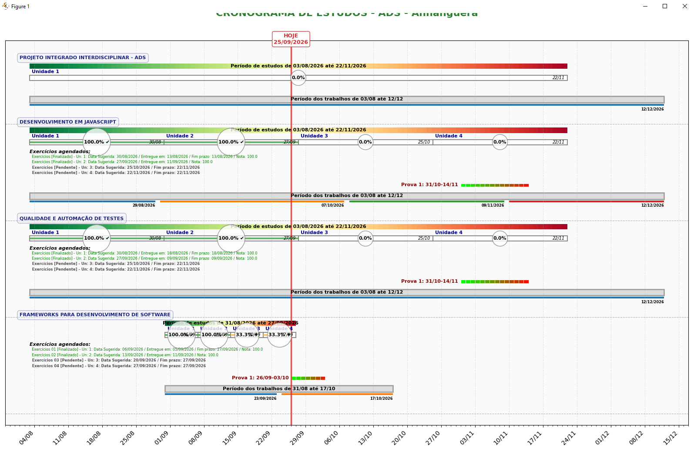

# 📅 Cronograma de Estudos

Sistema web desenvolvido em **Python + Flask** para gerenciamento, acompanhamento e visualização de cronogramas de atividades hierárquicas em uma linha do tempo interativa.

Embora tenha sido originalmente criado para acompanhar estudos acadêmicos, o projeto foi estruturado sobre um **modelo genérico de gestão de atividades**, o que permite sua adaptação para diferentes contextos — acadêmicos, pessoais, profissionais e empresariais.

O sistema implementa **CRUD completo em cinco níveis hierárquicos**, dashboard com indicadores, filtros por contexto, tabela de tarefas pendentes e geração de **gráficos interativos (Gantt e timeline)** com **Plotly**.

---

## 🎯 Objetivo

Oferecer uma ferramenta visual e interativa para **planejar, acompanhar e visualizar atividades distribuídas ao longo do tempo**, permitindo:

- cadastrar atividades em estrutura hierárquica;
- registrar prazos, datas de início e fim;
- acompanhar o progresso individual de cada etapa;
- visualizar o cronograma geral em formato de **gráfico Gantt**;
- identificar tarefas pendentes e próximas do vencimento;
- filtrar visualizações por contexto;
- calcular percentuais de conclusão por etapa.

O projeto nasceu da necessidade de **acompanhar os estudos em uma linha do tempo**, mas sua arquitetura foi pensada de forma genérica — o que amplia significativamente seu potencial de aplicação.

---

## ⚙️ Tecnologias utilizadas

### Back-end
- **Python**
- **Flask** — rotas, renderização de templates, `url_for`, manipulação de formulários
- **Jinja2** — template engine para renderização server-side

### Front-end
- **HTML5**
- **Bootstrap 5.1.3** — layout responsivo e componentes visuais
- **JavaScript** — interação com bibliotecas de gráficos
- **Emojis Unicode** — iconografia leve e acessível

### Visualização de dados
- **Plotly.js** — gráficos interativos (Gantt e timeline)

### Persistência
- **Arquivo JSON** (`cronograma_estudos.json`) — estrutura portátil, legível e facilmente adaptável

---

## 🖥️ Funcionalidades implementadas

### Gestão de disciplinas
- Cadastro, edição e exclusão;
- Definição de status, data de início, data de fim e fim dos trabalhos;
- Filtro de visualização por disciplina.

### Gestão de unidades
- Cadastro, edição e exclusão;
- Título, descrição e período (data de início e fim);
- Controle de aulas assistidas e exercícios finalizados;
- Cálculo automático de **percentual de conclusão** por unidade.

### Gestão de aulas
- Título, data e horário;
- Marcação de **assistida** e **leitura**;
- CRUD completo.

### Gestão de exercícios
- Título e data de entrega;
- Marcação de **finalizado**;
- CRUD completo.

### Gestão de trabalhos
- Data prevista, data de entrega e nota;
- CRUD completo.

### Gestão de provas
- Data de início, data de fim e nota;
- CRUD completo.

### Dashboard
- Cards de resumo:
  - **Total de Disciplinas**
  - **Disciplinas Cursando**
  - **Disciplinas Ativas**
- **Tabela de Tarefas Pendentes** com tipo, disciplina, título e data.

### Visualização gráfica
- **Timeline das disciplinas** (Plotly);
- **Gráfico Gantt interativo** (Plotly), com:
  - linha vertical indicando a **data atual ("HOJE")**;
  - barras de período de estudos por disciplina;
  - barras de unidades com percentual de conclusão;
  - barras de provas e períodos de trabalho;
  - marcação visual de progresso (0%, 33,3%, 100%);
  - cores indicando status (verde = concluído, amarelo = em andamento, vermelho = atrasado).
- Página dedicada para **gráfico analítico de linha temporal**.

---

## 🗄️ Persistência de dados

Os dados são carregados e armazenados em um arquivo **JSON** (`cronograma_estudos.json`), o que proporciona:

- simplicidade na estruturação dos dados;
- leitura e edição manual facilitadas;
- portabilidade do projeto;
- ausência de dependência de SGBD externo;
- facilidade de versionamento e migração.

Essa escolha torna o projeto **leve, autocontido e facilmente adaptável** para diferentes contextos.

---

## 🧠 Conceitos aplicados

### Desenvolvimento web
- Arquitetura baseada em rotas com Flask;
- Renderização server-side com Jinja2;
- Uso de `url_for` para geração dinâmica de URLs;
- Manipulação de formulários HTML;
- Estruturas condicionais e de repetição em templates;
- Passagem segura de dados do back-end para o JavaScript (`| safe`).

### Estruturas de dados
- Listas e dicionários aninhados;
- Hierarquia de objetos (Disciplina → Unidade → Aula/Exercício);
- Serialização e desserialização JSON;
- Índices e enumeração em templates.

### Front-end
- Layout responsivo com Bootstrap;
- Componentes de card, list-group, tabela e formulário;
- Integração com biblioteca de gráficos JavaScript (Plotly);
- Interatividade com filtros dinâmicos.

### Visualização de dados
- Construção de **gráficos Gantt**;
- Representação visual de progresso;
- Uso estratégico de cores para indicar status;
- Marcação temporal com linha de referência (data atual).

### Engenharia de Software
- Modelagem hierárquica de dados;
- Separação entre apresentação, lógica e persistência;
- CRUD completo em múltiplos níveis;
- Estrutura extensível e adaptável a outros domínios.

---

## 🏢 Potencial de aplicação

Apesar de ter sido criado para acompanhamento acadêmico pessoal, o sistema foi estruturado sobre um **modelo genérico de gestão de atividades hierárquicas com linha do tempo**. Isso significa que, com pequenos ajustes de nomenclatura e campos, ele pode ser aplicado em diversos contextos.

### 🎓 Acadêmico
- Acompanhamento de disciplinas, unidades, aulas, exercícios e provas;
- Uso por alunos, professores ou coordenadores;
- Preparatórios para concursos, certificações e exames.

### 💼 Gestão de projetos
- Projetos → fases → tarefas → entregas → validações;
- Implantação de sistemas, migração de dados, PMO;
- Acompanhamento de contratos e clientes.

### 🏭 Produção e operações
- Linhas de produção, ordens de serviço, lotes;
- Manutenção preventiva e corretiva;
- Controle de qualidade.

### 👥 Recursos Humanos
- Onboarding de colaboradores;
- Trilhas de treinamento corporativo;
- Avaliação de desempenho e PDI.

### 📣 Comercial e Marketing
- Funil de vendas;
- Cronograma editorial e de conteúdo;
- Lançamento de produtos.

### 💰 Financeiro e Administrativo
- Fechamento contábil;
- Auditoria e compliance;
- Planejamento orçamentário.

### 🖥️ Tecnologia da Informação
- Desenvolvimento de software (épicos, features, tarefas, bugs);
- DevOps e SRE;
- Qualidade e testes;
- Segurança da informação e governança.

### 🏗️ Engenharia, construção e indústria
- Obras, medições e vistorias;
- Projetos de engenharia;
- Pesquisa e desenvolvimento.

### 🩺 Saúde e serviços
- Protocolos clínicos;
- Planos de cuidado;
- Ordens de serviço.

### 🧑‍💼 Consultoria e serviços profissionais
- Projetos de consultoria;
- Advocacia, contabilidade e arquitetura;
- Gestão de serviços com etapas e aprovações.

Em todos esses contextos, a hierarquia **Disciplina → Unidade → Aula/Exercício → Trabalho/Prova** pode ser reinterpretada conforme o domínio, tornando o sistema um **modelo genérico de gestão de atividades com linha do tempo**.

---

## 🚀 Possíveis evoluções

O projeto foi construído sobre uma base sólida e extensível. Entre as evoluções possíveis estão:

### Curto prazo
- Migração da persistência de JSON para **banco de dados** (SQLite, PostgreSQL, MySQL);
- Exportação do cronograma em **PDF** e **Excel**;
- Notificações de prazos próximos;
- Gráficos adicionais (evolução de notas, comparativos entre disciplinas).

### Médio prazo
- **Autenticação e multiusuário**;
- **Perfis e permissões** (admin, gestor, executor);
- **API REST** para integração com outros sistemas;
- **Upload de anexos** e comentários por item;
- **Log de auditoria** e histórico de alterações.

### Longo prazo
- Transformação em **produto de gestão de atividades** adaptável a diferentes domínios;
- Integrações com **ERP, CRM e calendários** (Google Calendar, Outlook);
- **Deploy em nuvem** com escalabilidade;
- **Testes automatizados** e pipeline CI/CD;
- Versão **mobile** ou PWA.

*Essas possibilidades representam caminhos de evolução e não funcionalidades necessariamente implementadas na versão atual.*

---

## 📚 Contexto acadêmico e profissional

O projeto foi desenvolvido como parte da formação em **Análise e Desenvolvimento de Sistemas**, com o objetivo de aplicar, na prática, conceitos de:

- desenvolvimento web com Python e Flask;
- templates Jinja2;
- persistência de dados em JSON;
- visualização de dados com Plotly;
- organização de informações em estruturas hierárquicas.

A aplicação está diretamente relacionada ao acompanhamento do próprio cronograma de estudos do curso, o que reforça seu caráter prático e sua utilidade real — e, ao mesmo tempo, demonstra o potencial de generalização da arquitetura para contextos profissionais e empresariais.

---

## 👨‍💻 Autor

**Fábio Alexandre Riqueto**

Analista de Sistemas | Desenvolvedor de Software

Profissional de Tecnologia da Informação com mais de **30 anos de experiência** em desenvolvimento de sistemas, análise de processos, bancos de dados e soluções empresariais, atualmente cursando **Análise e Desenvolvimento de Sistemas**.

### Áreas de experiência e estudo

- Análise de Sistemas
- Desenvolvimento de Software
- Engenharia de Software
- Banco de Dados
- Desenvolvimento Web
- Python
- Java
- JavaScript
- SQL
- Flask
- Django
- C/C++
- Visual Basic 6
- Redes de computadores
- Integração Software/Hardware
- Arduino e ESP32
- Sistemas empresariais

---

## 📊 Exemplo de visualização do gráfico

---
## 📌 Observação

Este repositório possui finalidade **acadêmica e de portfólio profissional**.

O projeto documenta uma experiência prática de desenvolvimento web com **Python, Flask, Jinja2, Bootstrap e Plotly**, aplicando conceitos de CRUD hierárquico, persistência em JSON, dashboard com indicadores e visualização de dados em linha do tempo.

As informações apresentadas neste README procuram representar o projeto de forma objetiva, **distinguindo claramente as funcionalidades implementadas das possíveis evoluções futuras**.
